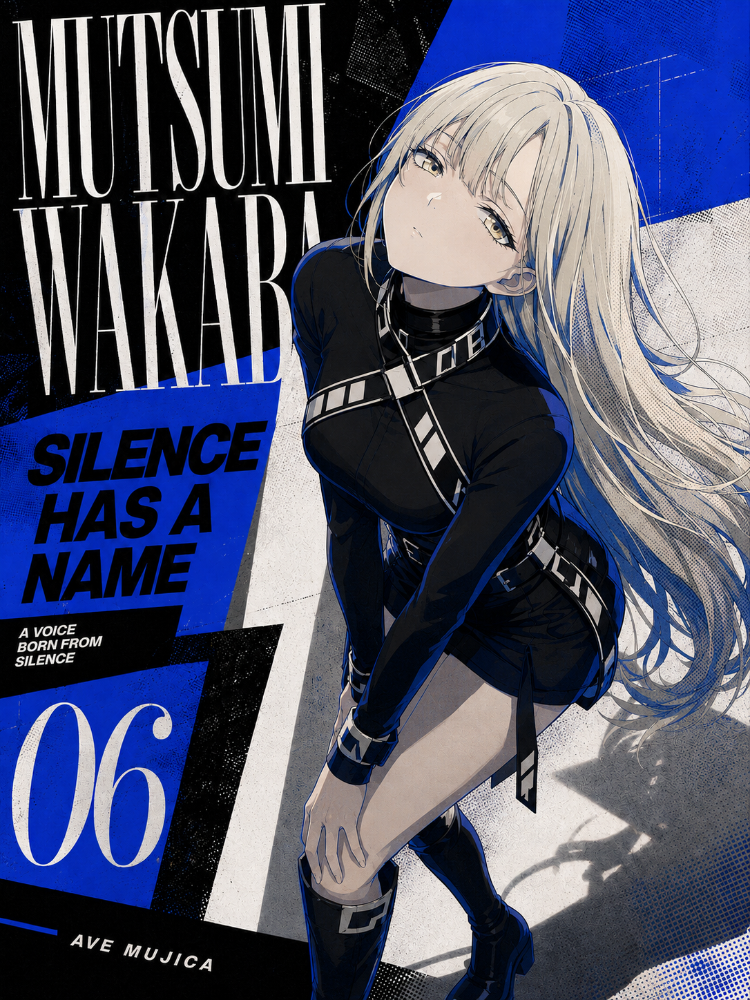
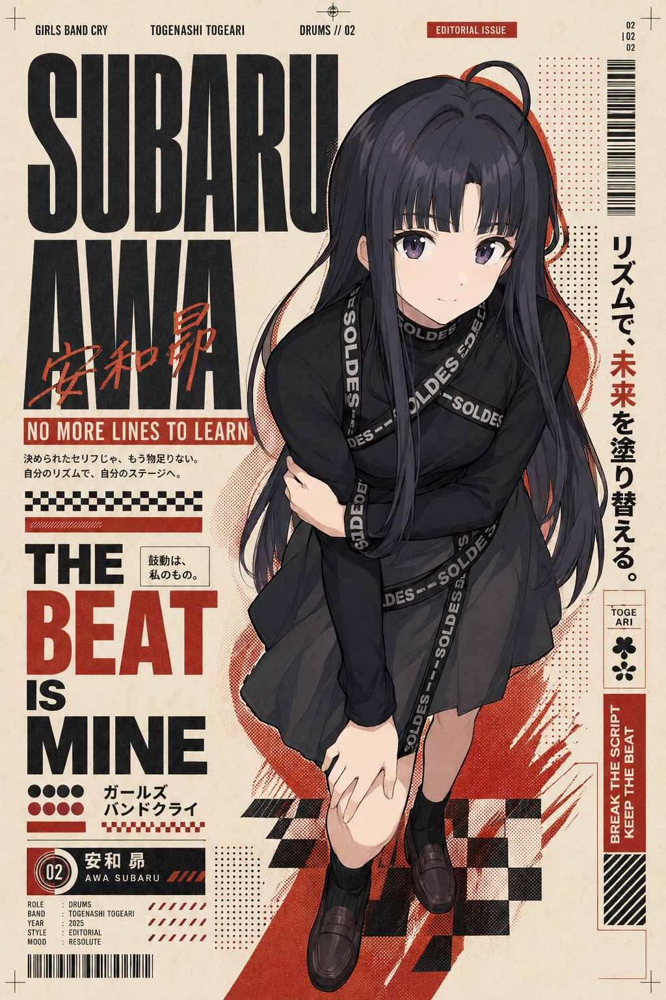

# Anime Editorial Poster Skill v2.0.0
求求你们点点星标 
[English](#english) · [中文](#中文)

---

# English

**Reference-driven anime editorial art direction for multi-reference character poster generation.**

Anime Editorial Poster v2 is designed to create anime editorial posters from multiple references while keeping the role of each reference isolated and controllable.

v2 replaces the fixed v1 fashion-poster formula with a **layout-reference-driven visual system**. Character identity, outfit, pose, typography, colour, lighting, print texture, and copywriting are rebuilt to belong to one coherent composition.

## Core idea

> **Each reference image has one job. The final poster is rebuilt as one unified art-directed system.**

The result should not look like a character illustration with typography added afterwards. Character surface, pose, silhouette, typography, graphic shapes, colour, negative space, and texture should interact as one design.

## What changed in v2

v1 relied on a relatively fixed editorial formula:

- white / warm-white backgrounds
- Didone / Bodoni-style type
- low-saturation fashion palettes
- hard cast shadows
- minimal editorial composition

v2 changes from **style-template driven** to **reference-system driven**:

- layout reference defines the visual language
- typography follows the reference instead of defaulting to Didone
- palette follows the reference instead of defaulting to muted colour
- lighting follows the reference instead of defaulting to hard shadow
- pose can be designed automatically from the layout
- copy can be generated from character personality and narrative context
- character silhouette actively interacts with typography and graphics
- reference contamination is explicitly prevented

## Reference responsibility system

### Character Reference
Controls:

- face identity
- hairstyle
- hair colour
- eye colour
- signature accessories
- recognizable character traits
- base character mood

Does not automatically control outfit, pose, layout, background, or lighting.

### Outfit Reference
Controls:

- silhouette
- neckline
- sleeves
- waistline
- hem
- fabric
- transparency
- layering
- accessories
- footwear
- jewellery
- colour relationships

Does not inherit the model's identity, hairstyle, pose, or background.

### Pose Reference
Controls:

- body gesture
- limb placement
- center of gravity
- head angle
- camera angle
- crop
- figure scale

Does not inherit identity, outfit, hairstyle, or colour palette.

### Layout / Editorial Reference
Controls the complete poster system:

- composition skeleton
- figure placement and scale
- crop logic
- negative space
- type family and proportion
- title hierarchy
- spacing rhythm
- text direction
- visual density
- graphic shapes
- image-text overlap
- colour relationships
- lighting language
- print / texture language
- overall visual tension

In v2, the layout reference is the primary visual-system reference.

## Layout-driven pose design

If no pose reference is provided, v2 can create a pose directly from the layout by reading:

- empty space
- title blocks
- diagonal movement
- graphic shapes
- crop boundaries
- image-text overlap
- center of gravity

Typical strategies:

- vertical compositions → elongated standing / side pose
- horizontal typography → seated / leaning / bent pose
- diagonal layouts → twisted or asymmetrical body axis
- large empty corner → gaze, hand, or hair direction leads into the space

Generic upright standing poses should be avoided when the layout calls for stronger interaction.

## Character-driven copywriting

When requested, v2 can generate editorial copy from the character's:

- personality
- role
- narrative tension
- relationships
- stage / band / team identity
- emotional arc
- symbolic motifs

Typical copy layers:

- **Main Title**
- **Character Statement**
- **Microcopy**
- **Issue / Chapter / Number**
- decorative Romanized / English / Japanese fragments

Avoid generic filler such as `FREEDOM / DREAM / BEAUTY / NIGHT` unless genuinely relevant. Do not fabricate official dialogue.

## Character × layout integration

The character is treated as a graphic element.

Possible interactions include:

- title behind the character
- selected letters partially covered by hair
- shoulder or clothing edge cutting into a type block
- numbers passing behind clothing
- hair acting as a directional graphic line
- body axis matching diagonal composition
- clothing colour linked to graphic shapes
- controlled overlap between typography and character

Important facial features, especially the eyes, should remain readable.

## Supported editorial directions

v2 can adapt to references such as:

- Minimal Fashion Editorial
- Japanese Magazine
- Neo-Retro
- Y2K Editorial
- Punk / Grunge
- Luxury Fashion
- Swiss / Grid
- Experimental Typography
- Gothic Editorial
- Pop Graphic
- Monochrome Editorial
- Collage Poster
- Art Book Cover
- Music Editorial

These labels are descriptive only. The reference itself remains the source of truth.

## Example invocation

```text
Use anime-editorial-poster-skill.

Image 1: layout reference
Image 2: outfit reference
Image 3: character reference
Pose: design automatically from Image 1
Copy: generate from the character's story background
Requirement: integrate the character into the layout system instead of simply replacing the original character
Aspect ratio: 3:4
```

Internal mapping:

```text
REF 1 = Layout
REF 2 = Outfit
REF 3 = Character
POSE = Layout-driven auto pose
COPY = Character-driven
```

## Example outputs

These examples demonstrate how the character surface, colour palette, print texture, and typography rhythm are fused into different graphic layout systems.

<p align="center">
  
  
</p>

The examples are unofficial AI-generated workflow demonstrations only. They do not include source/reference images and are not affiliated with any depicted character's rights holders.

## Installation

Recommended repository structure:

```text
anime-editorial-poster/
├── SKILL.md
├── README.md
├── README_EN.md
├── README_ZH.md
├── CHANGELOG.md
├── VERSION
└── examples/
```

Install or import the root `SKILL.md`.

Current version:

```text
2.0.0
```

## Updating

For an update such as `v2.1.0`:

1. modify `SKILL.md`
2. update `VERSION`
3. add release notes to `CHANGELOG.md`
4. update the README files if behaviour changes

```bash
git add .
git commit -m "feat: update anime-editorial-poster to v2.1.0"
git push origin main
```

## Production typography note

AI image models may not render small text accurately. For production work:

1. generate the integrated visual composition
2. preserve clear typography zones
3. rebuild exact text in Photoshop, Illustrator, Figma, Canva, or another layout tool

## Usage note

This repository provides a workflow and prompt-architecture skill only.

Users are responsible for ensuring that their use of character references, trademarks, copyrighted artwork, likenesses, and generated outputs complies with applicable rights and platform policies.


---

# 中文

**面向多参考图动漫角色海报生成的 Reference-Driven Editorial 视觉系统。**

Anime Editorial Poster v2 用于把角色、服装、姿势、版式等不同参考图拆分职责，再重新组织成一张统一的动漫 Editorial 海报。

v2 不再沿用 v1 固定的“白底 + Didone + 低饱和 + 硬投影”公式，而是把 **版式参考作为整张作品的视觉母系统**，再让角色身份、服装、姿势、字体、配色、光影、印刷纹理和文案共同适配它。

## 核心理念

> **每张参考图只负责一个明确职责，最终重新组合成一个完整、统一的视觉系统。**

最终效果不应该像“先画角色，再把文字贴上去”，而应该让角色表面、姿势、轮廓、字体、图形、留白、色彩和纹理本身就属于同一套设计语言。

## v2 相比 v1 的主要变化

v1 更接近固定 Editorial 模板：

- 白色 / 暖白背景
- Didone / Bodoni 类字体
- 低饱和时尚配色
- 明显硬投影
- 极简杂志式构图

v2 从 **固定模板驱动** 升级为 **参考系统驱动**：

- 版式参考决定整体视觉语言
- 字体跟随参考，不再默认 Didone
- 配色跟随参考，不再默认低饱和
- 光影跟随参考，不再默认硬投影
- 没有姿势图时，可直接根据版式设计姿势
- 文案可根据角色性格和故事背景生成
- 人物轮廓主动参与文字与图形构成
- 明确禁止不同参考图之间“串味”

## 参考图职责系统

### 角色参考 Character Reference

负责：

- 脸部身份
- 发型
- 发色
- 瞳色
- 固有配饰
- 标志性人物特征
- 角色基础气质

默认不继承原服装、原姿势、原背景、原版式与原光影。

### 服装参考 Outfit Reference

负责：

- 服装轮廓
- 领口
- 袖型
- 腰线
- 裙摆 / 裤型
- 材质
- 透明关系
- 层次
- 配饰
- 鞋袜
- 首饰
- 色彩关系

默认不继承模特脸部、发型、身份、姿势和背景。

### 姿势参考 Pose Reference

负责：

- 身体动作
- 肢体关系
- 重心
- 头部角度
- 镜头角度
- 裁切
- 人物比例

默认不继承人物身份、服装、发型与配色。

### 版式参考 Layout / Editorial Reference

负责整张海报的视觉母系统：

- 构图骨架
- 人物位置与比例
- 裁切逻辑
- 留白比例
- 字体类别与比例
- 主标题层级
- 字距 / 行距
- 文字方向
- 信息密度
- 图形元素
- 人物与文字遮挡关系
- 色彩关系
- 光影语言
- 印刷 / 纹理语言
- 整体视觉张力

在 v2 中，版式参考是最重要的视觉系统参考。

## 根据版式自动设计姿势

如果没有姿势参考，v2 会读取：

- 留白
- 标题区域
- 斜向视觉动线
- 图形
- 裁切边界
- 人物与文字的遮挡关系
- 整体重心

再设计适合该版式的人物动作。

常见策略：

- 竖向构图 → 拉长站姿、侧身、S 型身体轴
- 横向大字 → 坐姿、俯身、横向手臂
- 斜向构图 → 扭腰、偏轴、非对称动作
- 大面积空白 → 用视线、手势或头发走势引导留白

当版式本身需要更强互动时，应避免普通站桩。

## 角色故事文案系统

如果用户要求“根据角色故事背景生成文字”，v2 会优先读取：

- 角色性格
- 角色身份
- 故事矛盾
- 人物关系
- 舞台 / 乐队 / 团队身份
- 情绪变化
- 象征元素

常见文案层级：

- **Main Title / 主标题**
- **Character Statement / 角色陈述**
- **Microcopy / 编辑小字**
- **Issue / Chapter / Number / 编号系统**
- 英文 / 罗马字 / 日文碎片装饰文字

避免把 `FREEDOM / DREAM / BEAUTY / NIGHT` 等泛化词机械套用到所有角色，也不得把 AI 生成文案伪装成官方台词。

## 人物 × 版式融合

角色本身必须成为图形构成的一部分。

可以使用：

- 主标题位于人物后方
- 头发局部遮挡文字
- 肩部或服装边缘切入标题区域
- 数字从服装后方穿过
- 头发作为视觉引导线
- 身体轴线呼应斜向构图
- 服装颜色与背景图形建立关系
- 字体与人物轮廓发生控制性的遮挡

同时保证眼睛与关键五官可读，角色识别度稳定。

## 可适配的 Editorial 类型

v2 可以根据参考图适配：

- 极简时尚 Editorial
- 日系杂志
- Neo-Retro 新复古
- Y2K
- Punk / Grunge
- Luxury Fashion
- Swiss Grid
- Experimental Typography
- Gothic Editorial
- Pop Graphic
- 黑白 Editorial
- Collage 拼贴
- Art Book Cover
- Music Editorial

这些名称只用于辅助分析，最终仍以用户提供的版式参考为准。

## 推荐调用方式

```text
使用 anime-editorial-poster-skill。

图一：版式参考
图二：服装参考
图三：角色参考
姿势：按照图一版式自动设计
文字：结合角色故事背景自动生成
要求：角色必须融入图一的版式设计语言，不是简单换角色
比例：3:4
```

内部映射：

```text
REF 1 = Layout
REF 2 = Outfit
REF 3 = Character
POSE = Layout-driven auto pose
COPY = Character-driven
```

## 示例效果

下面的示例用于展示角色表面处理、色彩系统、印刷纹理和字体节奏如何融入不同的图形版式系统。

<p align="center">
  
  
</p>

以上示例仅为非官方 AI 生成工作流演示，不包含原始 / 参考图片，也不代表与示例中涉及角色的任何权利方存在关联、合作或授权关系。

## 安装

推荐仓库结构：

```text
anime-editorial-poster/
├── SKILL.md
├── README.md
├── README_EN.md
├── README_ZH.md
├── CHANGELOG.md
├── VERSION
└── examples/
```

安装时使用仓库根目录的 `SKILL.md`。

当前版本：

```text
2.0.0
```

## 正式排版注意事项

AI 生图模型对精确小文字仍可能不稳定。

正式海报、印刷或商业发布建议：

1. 先用 Skill 生成完整视觉母版
2. 保留明确的文字区域
3. 再使用 Photoshop、Illustrator、Figma、Canva 等工具完成精确文字排版

## 使用说明

本仓库仅提供工作流与 Prompt 架构 Skill。

使用者应自行确认角色参考、商标、版权素材、人物形象及最终生成内容的使用方式符合相关权利要求与平台规则。

